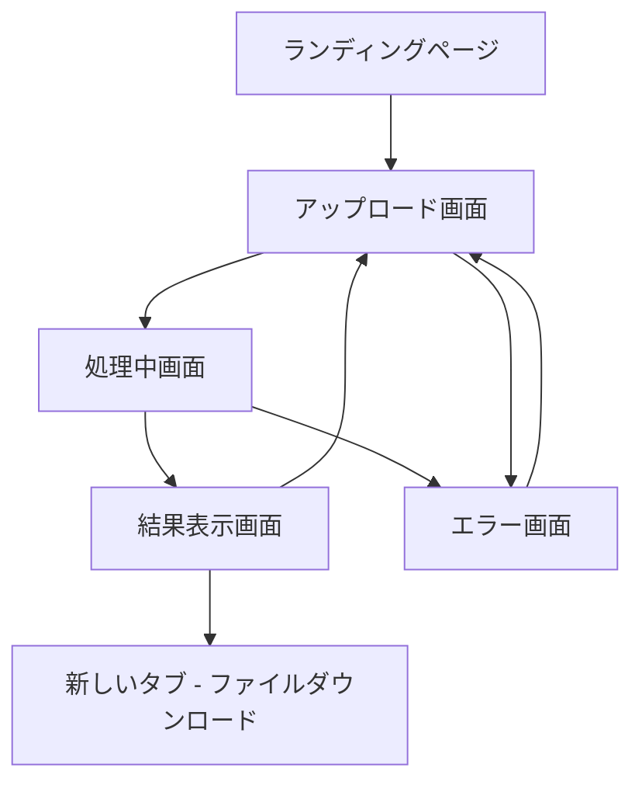

# Whisper文字起こしツール 画面遷移図・UI設計

## 画面一覧

### 1. ランディングページ (/)
- **目的**: サービス概要説明、ユーザー導線
- **主要要素**: ヒーロセクション、機能紹介、開始ボタン

### 2. アップロード画面 (/upload)
- **目的**: ファイルアップロードとオプション設定
- **主要要素**: ドロップゾーン、進捗表示、設定オプション

### 3. 処理中画面 (/processing/:id)
- **目的**: 文字起こし進捗表示
- **主要要素**: 進捗バー、推定時間、キャンセルボタン

### 4. 結果表示画面 (/result/:id)
- **目的**: 文字起こし結果表示・編集・出力
- **主要要素**: テキスト表示、編集機能、出力オプション

### 5. エラー画面 (/error)
- **目的**: エラー情報表示と対処方法案内
- **主要要素**: エラー内容、再試行ボタン、サポート情報

## 画面遷移フロー



## 詳細画面設計

### 1. ランディングページ (/)

#### レイアウト構成
```
┌─────────────────────────────────────────┐
│ ヘッダー [Logo] [GitHubリンク] [使い方]     │
├─────────────────────────────────────────┤
│              ヒーローセクション              │
│      🎙️ Whisper文字起こしツール        │
│     セミナー音声を素早く文字化しよう        │
│        [今すぐ始める] [サンプルを見る]      │
├─────────────────────────────────────────┤
│                特徴セクション              │
│  [🆓完全無料] [⚡高速処理] [🎯高精度]    │
│  [📱レスポンシブ] [🔒安全] [📄多形式]     │
├─────────────────────────────────────────┤
│              使い方セクション              │
│     1. ファイルアップロード ➜             │
│     2. 自動文字起こし ➜                  │
│     3. 結果編集・出力                    │
├─────────────────────────────────────────┤
│     対応ファイル形式・セラピスト向け特典      │
├─────────────────────────────────────────┤
│ フッター [利用規約] [プライバシー] [連絡先]   │
└─────────────────────────────────────────┘
```

#### 主要コンポーネント
```typescript
// components/LandingPage.tsx
export const LandingPage: React.FC = () => {
  return (
    <Container maxWidth="lg">
      {/* ヒーローセクション */}
      <Hero />

      {/* 特徴セクション */}
      <Features />

      {/* 使い方セクション */}
      <HowToUse />

      {/* 対応形式セクション */}
      <SupportedFormats />
    </Container>
  );
};

const Hero: React.FC = () => (
  <Box sx={{ textAlign: 'center', py: 8 }}>
    <Typography variant="h2" component="h1" gutterBottom>
      🎙️ Whisper文字起こしツール
    </Typography>
    <Typography variant="h5" color="text.secondary" paragraph>
      セラピスト・医療従事者向け完全無料音声文字化サービス
    </Typography>
    <Button
      variant="contained"
      size="large"
      href="/upload"
      sx={{ mr: 2 }}
    >
      今すぐ始める
    </Button>
    <Button variant="outlined" size="large">
      サンプルを見る
    </Button>
  </Box>
);
```

### 2. アップロード画面 (/upload)

#### レイアウト構成
```
┌─────────────────────────────────────────┐
│ ヘッダー [← 戻る] [ロゴ] [ヘルプ]         │
├─────────────────────────────────────────┤
│           ファイルアップロードエリア          │
│ ┌─────────────────────────────────────┐ │
│ │     🎵 ファイルをドロップまたは      │ │
│ │        クリックして選択           │ │
│ │                               │ │
│ │   対応形式: MP3, WAV, MP4, MOV    │ │
│ │     最大サイズ: 500MB           │ │
│ │     最大時間: 3時間            │ │
│ └─────────────────────────────────────┘ │
├─────────────────────────────────────────┤
│              オプション設定               │
│  言語: [自動検出 ▼] [日本語] [英語]       │
│  □ タイムスタンプを含める              │
│  □ 話者分離を試行                   │
│  □ 医療用語辞書を適用                │
├─────────────────────────────────────────┤
│           アップロード進捗エリア            │
│  📁 filename.mp3 (125MB)           │
│  ███████████████████████████ 100%    │
│            [文字起こし開始]             │
└─────────────────────────────────────────┘
```

#### ステート管理
```typescript
// store/uploadStore.ts
interface UploadState {
  file: File | null;
  uploadProgress: number;
  uploadStatus: 'idle' | 'uploading' | 'completed' | 'error';
  options: {
    language: 'auto' | 'ja' | 'en';
    includeTimestamps: boolean;
    speakerDetection: boolean;
    medicalTerms: boolean;
  };
}

const useUploadStore = create<UploadState>((set) => ({
  file: null,
  uploadProgress: 0,
  uploadStatus: 'idle',
  options: {
    language: 'auto',
    includeTimestamps: true,
    speakerDetection: false,
    medicalTerms: true
  },
  // アクション定義...
}));
```

### 3. 処理中画面 (/processing/:id)

#### レイアウト構成
```
┌─────────────────────────────────────────┐
│ ヘッダー [ロゴ] [ホームに戻る]             │
├─────────────────────────────────────────┤
│               処理状況表示                │
│        🔄 音声を文字起こし中...         │
│                                       │
│    ████████████░░░░░░░░░░░░░ 65%       │
│                                       │
│      推定残り時間: あと 2分30秒           │
│      処理サイズ: 125MB / 125MB         │
├─────────────────────────────────────────┤
│              現在の処理段階               │
│   ✅ ファイルアップロード完了             │
│   ✅ 音声前処理完了                   │
│   🔄 Whisper API処理中...            │
│   ⏳ 結果後処理待機中                  │
├─────────────────────────────────────────┤
│               操作ボタン                │
│        [処理をキャンセル] [最小化]        │
│                                       │
│       💡 この間にコーヒーはいかが？       │
└─────────────────────────────────────────┘
```

#### リアルタイム更新
```typescript
// components/ProcessingScreen.tsx
export const ProcessingScreen: React.FC = () => {
  const { transcriptionId } = useParams();
  const [status, setStatus] = useState<ProcessingStatus>();

  useEffect(() => {
    const interval = setInterval(async () => {
      try {
        const response = await api.getTranscriptionStatus(transcriptionId);
        setStatus(response.data);

        if (response.data.status === 'completed') {
          navigate(`/result/${transcriptionId}`);
        } else if (response.data.status === 'failed') {
          navigate('/error', { state: { error: response.data.error } });
        }
      } catch (error) {
        navigate('/error', { state: { error } });
      }
    }, 2000);

    return () => clearInterval(interval);
  }, [transcriptionId]);

  return (
    <ProcessingView
      progress={status?.progress ?? 0}
      estimatedTime={status?.estimatedTime}
      currentStage={status?.currentStage}
    />
  );
};
```

### 4. 結果表示画面 (/result/:id)

#### レイアウト構成
```
┌─────────────────────────────────────────┐
│ ヘッダー [← 戻る] [ロゴ] [新しい文字起こし] │
├─────────────────────────────────────────┤
│              結果サマリー                │
│  📄 filename.mp3 の文字起こし結果        │
│  ⏱️ 処理時間: 3分12秒 | 📊 精度: 96%    │
│  [📝 編集] [📋 コピー] [💾 保存] [🔄 再処理] │
├─────────────────────────────────────────┤
│           文字起こし結果表示エリア          │
│ ┌─────────────────────────────────────┐ │
│ │ 00:00 - 今日は肩甲骨の運動療法につい │ │
│ │ てお話しします。                   │ │
│ │                               │ │
│ │ 00:15 - まず解剖学的な基礎から確認 │ │
│ │ していきましょう。肩甲骨は...      │ │
│ │                               │ │
│ │ [スクロール可能エリア]              │ │
│ └─────────────────────────────────────┘ │
├─────────────────────────────────────────┤
│              出力オプション               │
│  📄 [テキスト] 🎬 [SRT字幕] 📝 [マークダウン] │
│  📊 [JSON] 📋 [プレーンテキスト]         │
│                                       │
│       [すべての形式をダウンロード]         │
└─────────────────────────────────────────┘
```

#### 編集機能
```typescript
// components/EditableTranscription.tsx
export const EditableTranscription: React.FC<{
  segments: TranscriptionSegment[];
  onEdit: (segments: TranscriptionSegment[]) => void;
}> = ({ segments, onEdit }) => {
  const [editingIndex, setEditingIndex] = useState<number | null>(null);

  return (
    <Box>
      {segments.map((segment, index) => (
        <SegmentEditor
          key={index}
          segment={segment}
          isEditing={editingIndex === index}
          onStartEdit={() => setEditingIndex(index)}
          onFinishEdit={(newText) => {
            const newSegments = [...segments];
            newSegments[index] = { ...segment, text: newText };
            onEdit(newSegments);
            setEditingIndex(null);
          }}
        />
      ))}
    </Box>
  );
};

const SegmentEditor: React.FC<{
  segment: TranscriptionSegment;
  isEditing: boolean;
  onStartEdit: () => void;
  onFinishEdit: (text: string) => void;
}> = ({ segment, isEditing, onStartEdit, onFinishEdit }) => {
  const [editText, setEditText] = useState(segment.text);

  if (isEditing) {
    return (
      <Box sx={{ mb: 2 }}>
        <Typography variant="caption" color="text.secondary">
          {formatTime(segment.start)} - {formatTime(segment.end)}
        </Typography>
        <TextField
          fullWidth
          multiline
          value={editText}
          onChange={(e) => setEditText(e.target.value)}
          onBlur={() => onFinishEdit(editText)}
          onKeyDown={(e) => {
            if (e.key === 'Enter' && e.ctrlKey) {
              onFinishEdit(editText);
            }
          }}
        />
      </Box>
    );
  }

  return (
    <Box
      sx={{ mb: 2, cursor: 'pointer' }}
      onClick={onStartEdit}
    >
      <Typography variant="caption" color="text.secondary">
        {formatTime(segment.start)} - {formatTime(segment.end)}
      </Typography>
      <Typography paragraph>
        {segment.text}
      </Typography>
    </Box>
  );
};
```

### 5. エラー画面 (/error)

#### レイアウト構成
```
┌─────────────────────────────────────────┐
│ ヘッダー [ロゴ] [ホームに戻る]             │
├─────────────────────────────────────────┤
│                エラー表示                │
│              ⚠️ エラーが発生              │
│                                       │
│        ファイルサイズが大きすぎます         │
│      (最大500MBまで対応しています)        │
│                                       │
│            考えられる解決方法:            │
│      • ファイルを圧縮してください          │
│      • 動画の場合は音声のみ抽出してください    │
│      • 複数の短いファイルに分割してください    │
├─────────────────────────────────────────┤
│               操作ボタン                │
│         [もう一度試す] [ヘルプを見る]       │
│                                       │
│     問題が解決しない場合は下記までご連絡      │
│        📧 support@example.com         │
└─────────────────────────────────────────┘
```

## モバイル対応

### レスポンシブブレークポイント
```typescript
// theme/breakpoints.ts
export const breakpoints = {
  xs: 0,     // 〜599px (スマートフォン)
  sm: 600,   // 600px〜 (タブレット縦)
  md: 960,   // 960px〜 (タブレット横・小さなデスクトップ)
  lg: 1280,  // 1280px〜 (デスクトップ)
  xl: 1920   // 1920px〜 (大型デスクトップ)
};
```

### モバイル最適化ポイント

#### 1. アップロード画面
- ドロップゾーンをタップ対応
- ファイル選択ボタンを大きく表示
- 進捗表示を縦配置に変更

#### 2. 結果表示画面
- スワイプによるセグメント間移動
- タップで編集モード切り替え
- フローティングアクションボタンで出力オプション

#### 3. 処理中画面
- 縦向き表示での最適化
- プッシュ通知（PWA）での完了通知

## アクセシビリティ対応

### WAI-ARIA準拠
```typescript
// components/AccessibleFileUpload.tsx
export const AccessibleFileUpload: React.FC = () => {
  return (
    <Box
      role="button"
      tabIndex={0}
      aria-label="音声または動画ファイルをアップロード"
      aria-describedby="upload-instructions"
      onKeyDown={(e) => {
        if (e.key === 'Enter' || e.key === ' ') {
          // ファイル選択ダイアログを開く
        }
      }}
    >
      <Typography id="upload-instructions" variant="body2">
        ドラッグ&ドロップまたはクリックしてファイルを選択してください。
        対応形式: MP3, WAV, MP4, MOV, AVI (最大500MB)
      </Typography>
    </Box>
  );
};
```

### キーボードナビゲーション
- Tab/Shift+Tab: フォーカス移動
- Enter/Space: ボタン実行
- Ctrl+Enter: 編集完了
- Esc: 編集キャンセル

### スクリーンリーダー対応
- 進捗状況の読み上げ
- エラーメッセージの明確な伝達
- ファイル情報の詳細読み上げ

## Progressive Web App (PWA) 機能

### Service Worker
```typescript
// public/sw.js
self.addEventListener('message', (event) => {
  if (event.data && event.data.type === 'TRANSCRIPTION_COMPLETE') {
    self.registration.showNotification('文字起こし完了', {
      body: '結果を確認してください',
      icon: '/icon-192x192.png',
      badge: '/badge-72x72.png',
      actions: [
        {
          action: 'view',
          title: '結果を見る'
        }
      ]
    });
  }
});
```

### マニフェスト設定
```json
{
  "name": "Whisper文字起こしツール",
  "short_name": "WhisperTool",
  "description": "セラピスト向け無料音声文字起こしサービス",
  "start_url": "/",
  "display": "standalone",
  "background_color": "#ffffff",
  "theme_color": "#1976d2",
  "icons": [
    {
      "src": "/icon-192x192.png",
      "sizes": "192x192",
      "type": "image/png"
    }
  ]
}
```

---

**作成日**: 2025年9月19日
**バージョン**: 1.0
**レビュー担当**: UI/UXデザイナー