# Whisper文字起こしツール システム設計図

## システム全体アーキテクチャ

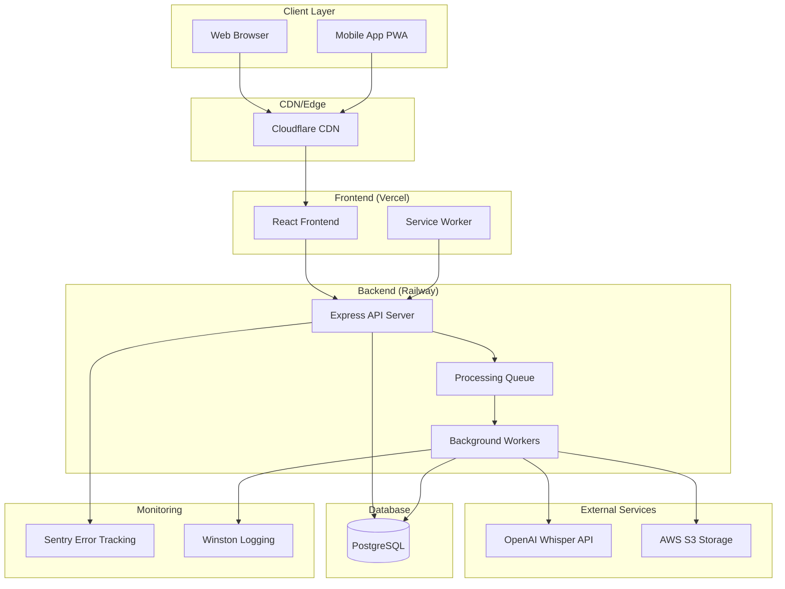

## 詳細コンポーネント設計

### 1. フロントエンド アーキテクチャ

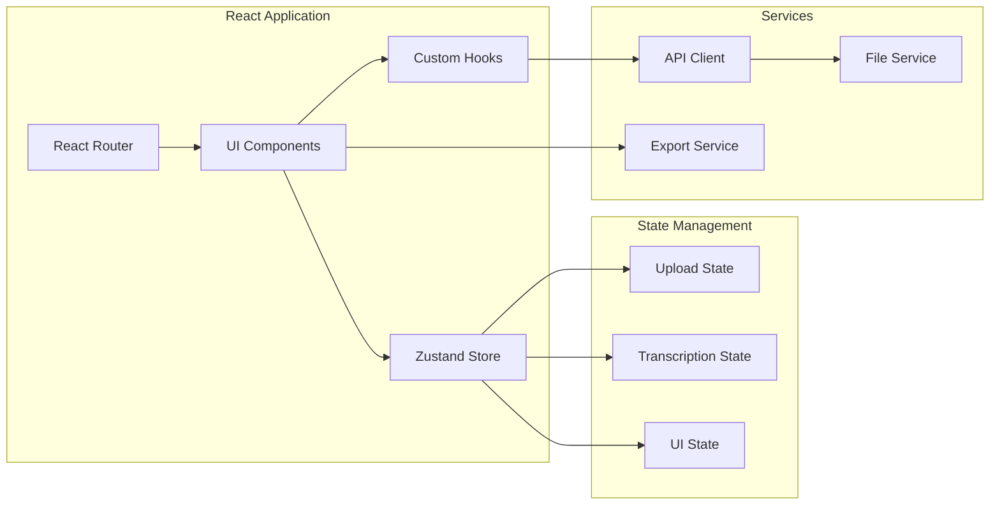

### 2. バックエンド アーキテクチャ

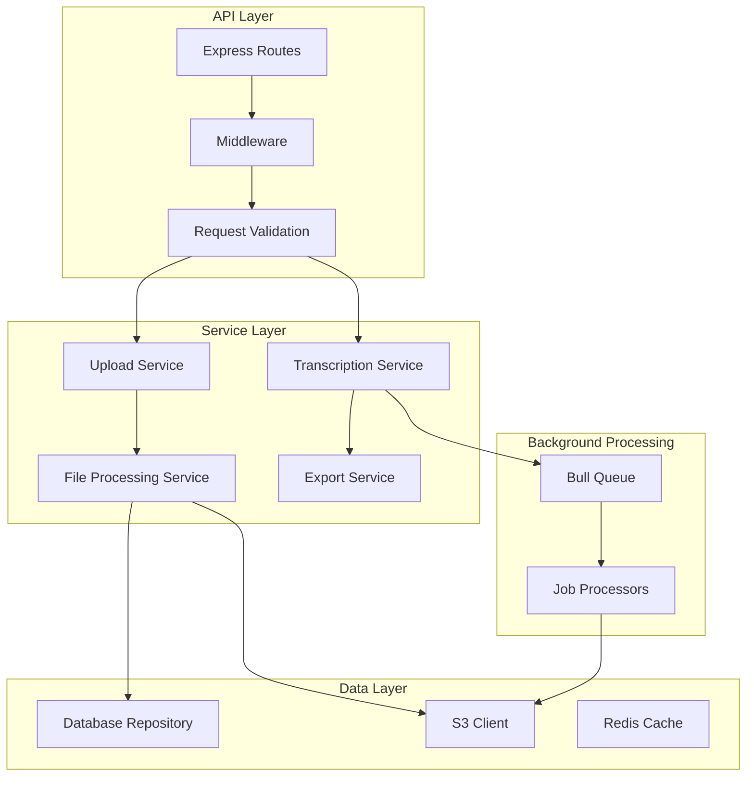

## データフロー図

### 1. ファイルアップロード処理フロー

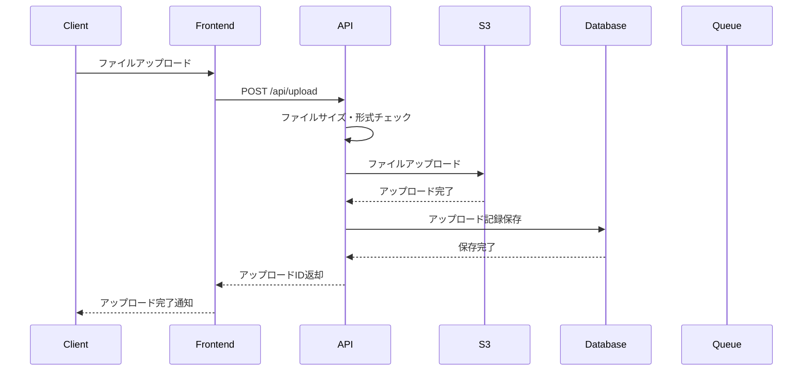

### 2. 文字起こし処理フロー

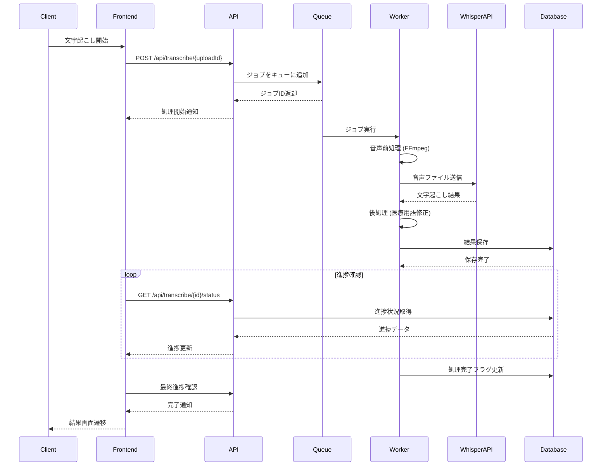

## インフラストラクチャ設計

### 1. デプロイメント構成

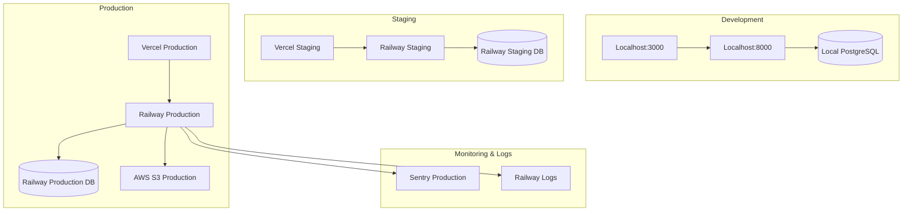

### 2. スケーリング戦略

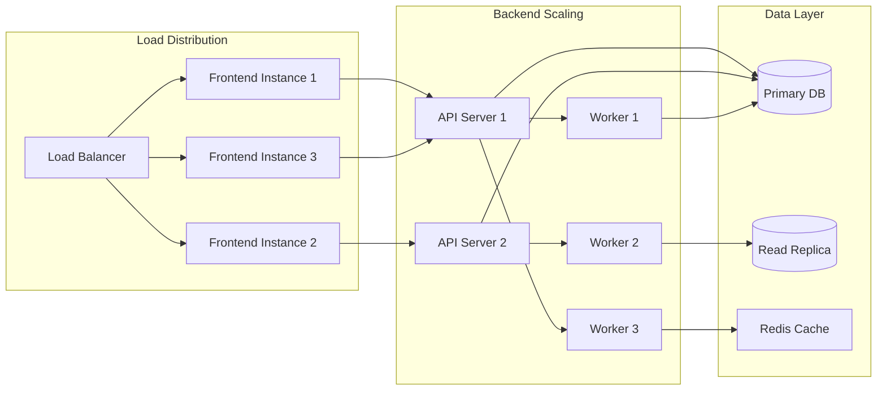

## セキュリティアーキテクチャ

### 1. セキュリティレイヤー

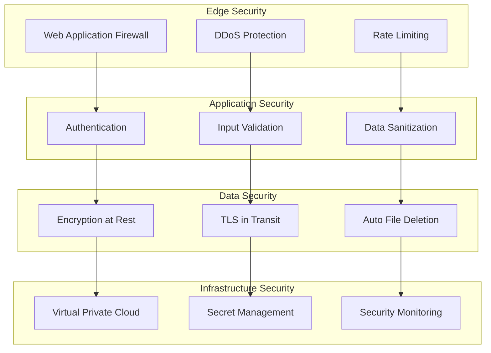

### 2. データプライバシー保護

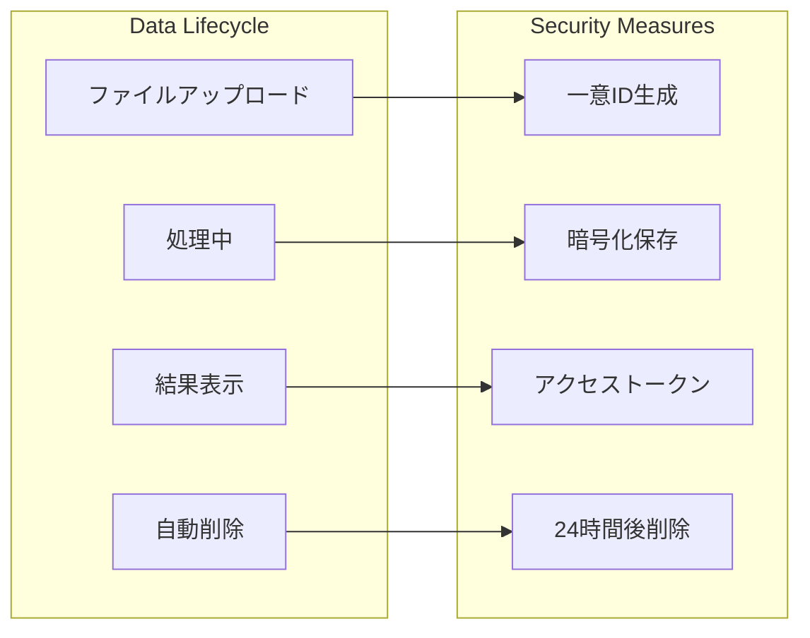

## パフォーマンス最適化

### 1. フロントエンド最適化

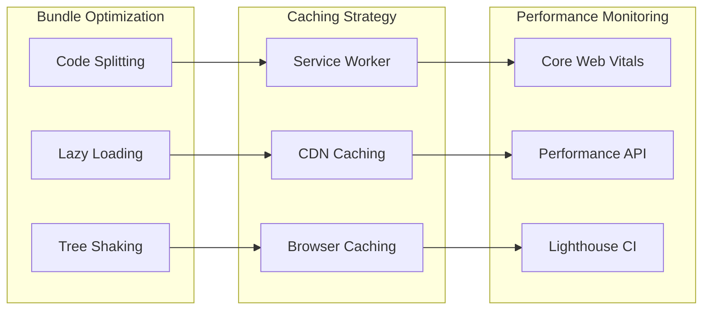

### 2. バックエンド最適化

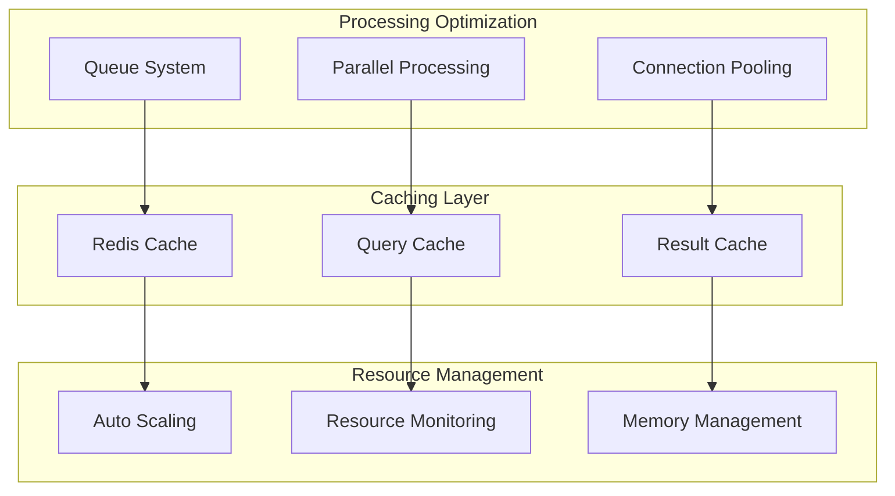

## 監視・運用アーキテクチャ

### 1. 監視システム

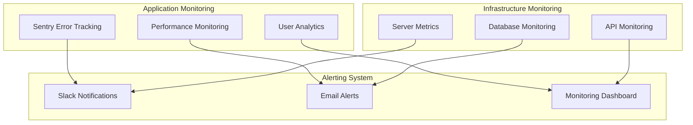

### 2. ログ管理

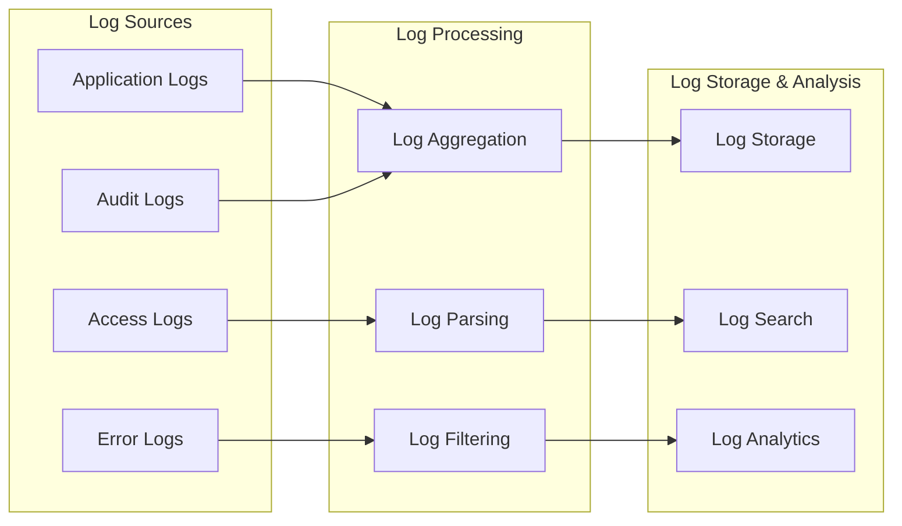

## 開発・デプロイメントパイプライン

### 1. CI/CD パイプライン

```mermaid
graph LR
    subgraph "Development"
        LOCAL_DEV[Local Development]
        FEATURE_BRANCH[Feature Branch]
        PULL_REQUEST[Pull Request]
    end

    subgraph "CI Pipeline"
        AUTOMATED_TESTS[Automated Tests]
        TYPE_CHECK[Type Checking]
        LINTING[Code Linting]
        BUILD[Build Process]
    end

    subgraph "CD Pipeline"
        STAGING_DEPLOY[Staging Deploy]
        E2E_TESTS[E2E Tests]
        PRODUCTION_DEPLOY[Production Deploy]
        HEALTH_CHECK[Health Check]
    end

    LOCAL_DEV --> FEATURE_BRANCH
    FEATURE_BRANCH --> PULL_REQUEST
    PULL_REQUEST --> AUTOMATED_TESTS
    AUTOMATED_TESTS --> TYPE_CHECK
    TYPE_CHECK --> LINTING
    LINTING --> BUILD
    BUILD --> STAGING_DEPLOY
    STAGING_DEPLOY --> E2E_TESTS
    E2E_TESTS --> PRODUCTION_DEPLOY
    PRODUCTION_DEPLOY --> HEALTH_CHECK
```

### 2. 環境管理

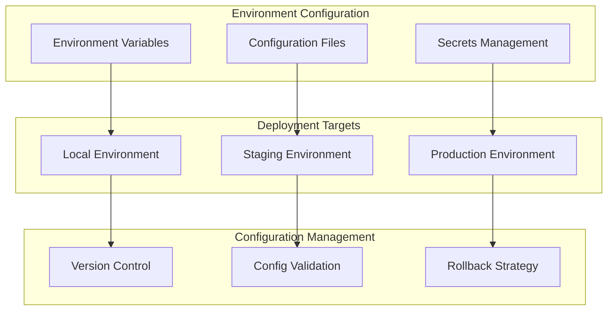

## 災害復旧・事業継続計画

### 1. バックアップ戦略

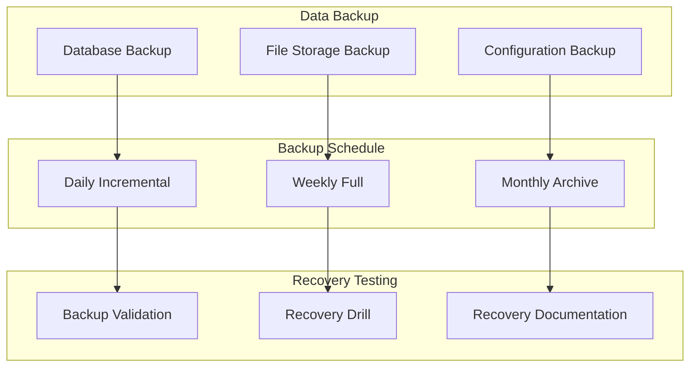

### 2. 高可用性設計

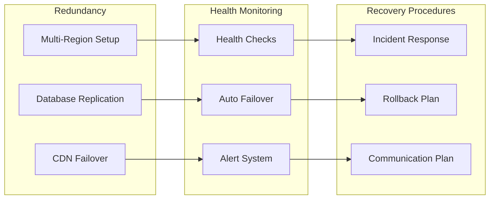

---

**作成日**: 2025年9月19日
**バージョン**: 1.0
**承認者**: システムアーキテクト
**次回見直し**: システム実装開始時